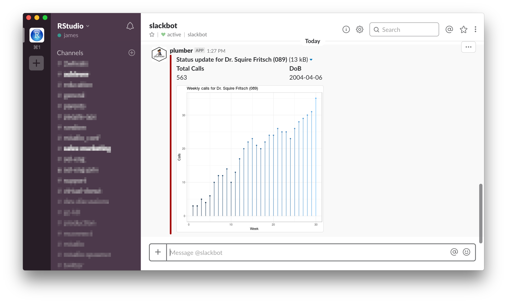
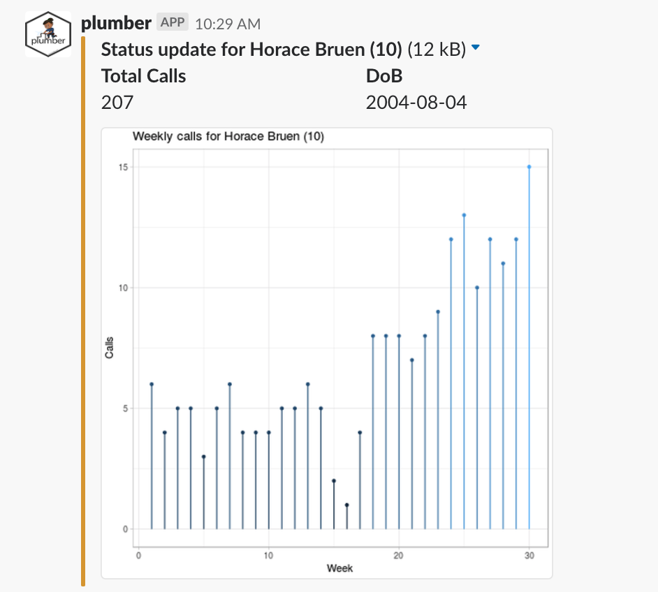
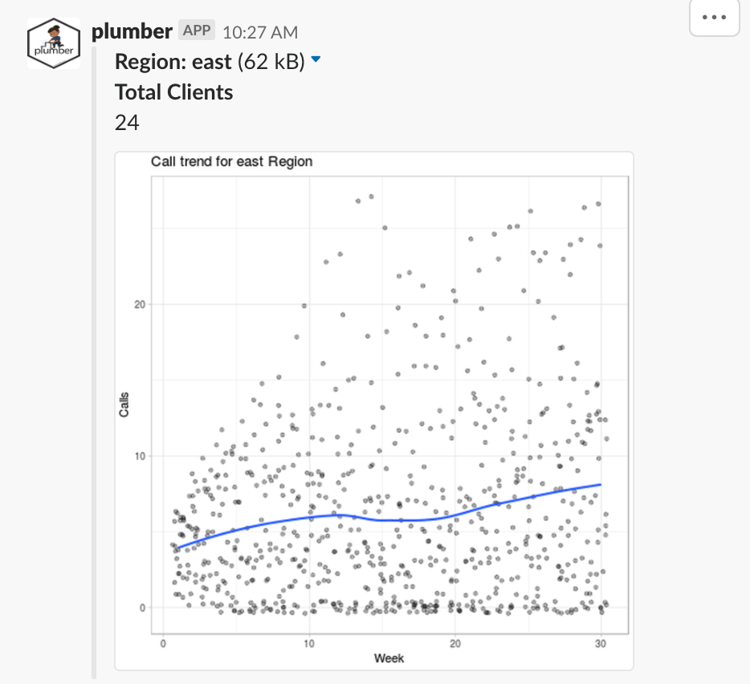
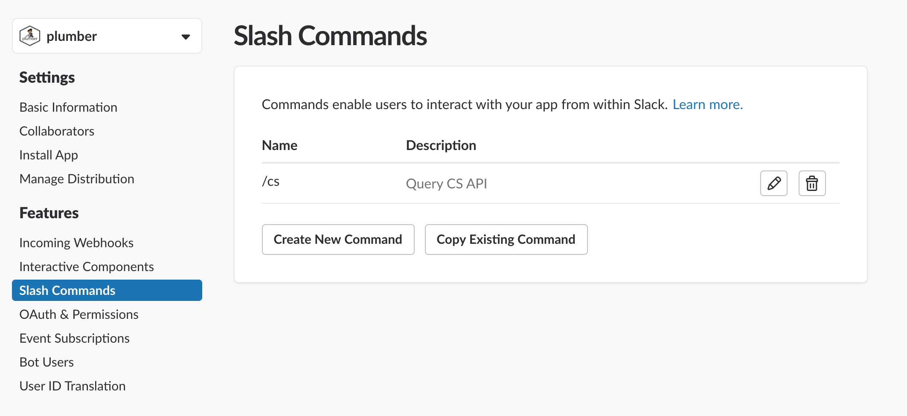
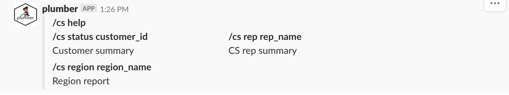
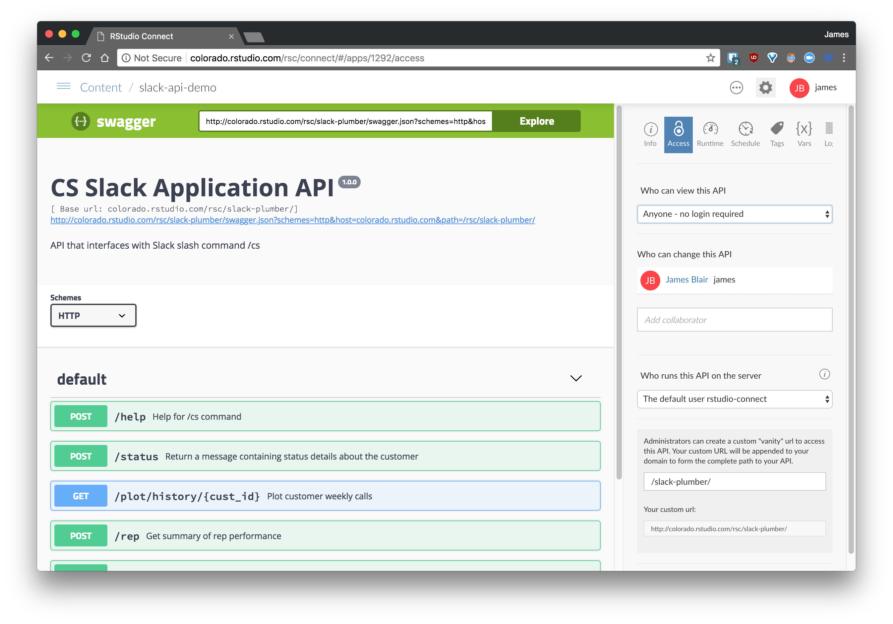
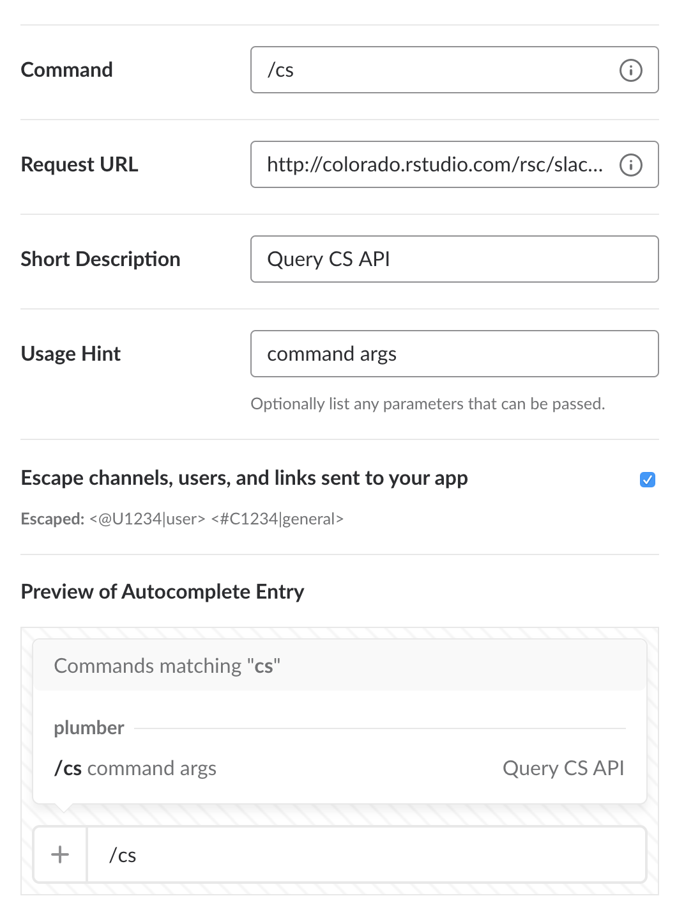

```{r setup, include=FALSE}
knitr::opts_chunk$set(eval = FALSE)

knitr::read_chunk("plumber.R")
```

*See [Slack and Plumber on R
Views](https://rviews.rstudio.com/2018/08/30/slack-and-plumber-part-one/)
for a discussion of this code.*

This asset shows how [`plumber`](https://www.rplumber.io) can be used to 
build a [Slack slash command](https://api.slack.com/slash-commands). The API 
is built on top of a [simulated customer dataset](customer-data-sim.Rmd) that 
contains details about customer call history. The slash command provides 
access to customer status report as well as customer success rep reports 
directly from within Slack. The goal of this integration is to highlight the 
strengths of `plumber` and how it can be used to *reliably and securely 
integrate R with other products and services*.

[](http://colorado.rstudio.com/rsc/slack-plumber/__swagger__/)

## Using

Once you have created the slack app and the slash command as described
in [Getting Started](#getting-started), you can access the
[API](http://colorado.rstudio.com/rsc/slack-plumber/__swagger__/) from
within the slack interface.

### Commands

    /cs help
    /cs status <customer_id>
    /cs rep <rep_name>
    /cs region <region_name>

### Examples

Try the following examples using the `/cs` command with your
[slackbot](https://get.slack.help/hc/en-us/articles/202026038-An-introduction-to-Slackbot).

    /cs status 10



    /cs rep Lovey Torp MD


    /cs region east



### Simulated data

The API pulls data from a simulated customer dataset using the
[`wakefield`](https://github.com/trinker/wakefield) package and the
[`charlatan`](https://github.com/ropensci/charlatan) package. You can
use the following levels for `rep`, `region`, and `id`.

| Rep                        | Region | ID  |
| -------------------------- | ------ | --- |
| Lovey Torp MD              | North  | 1   |
| Marla Nitzsche             | South  | 2   |
| Miss Halle Heidenreich DVM | East   | 3   |
| Miss Jayne Sanford         | West   | 4   |
| Ms. Arely Strosin PhD      |        | …   |
| Sannie Schuppe DDS         |        | 100 |

### Details

Instead of registering a different command for each endpoint, the first
argument provided to the slash command is the endpoint while the
subsequent argument(s) (if necessary) provide additional data to be
passed to the specified endpoint. This way, a single slash command
serves multiple endpoints without polluting the slash command namespace.

To access a customer status report, enter `/cs status <id>` in Slack,
where `id` is a valid customer ID from the simulated data. The customer
status report includes the customer name, total calls, date of birth,
and a plot call totals for the last 20 weeks. The color of the message
is an indication of customer health. Green indicates the customer has no
issues while red indicates the customer has a high volume of calls,
indicating a potential problem.

Help for all available commands can be accessed by entering `/cs help`
or simply `/cs` into Slack.

---

## Getting Started
In order to build a Slack app, you must have a Slack account and [follow the
directions](https://api.slack.com) for creating a Slack app. The app will be
tied to a specific workspace, so select a Slack workspace you anticipate
belonging to long term. By default, your app will only be available to this
workspace, although it's possible to expand access to the app later on.

Once the app has been created in Slack, create a new slash command through
which the end user will interact with the app.



Specific details for building slash commands can be found [here](https://api.slack.com/slash-commands).
This will be a helpful reference through the remainder of the walk through.

## Plumbing the API
If you haven't already, install the `plumber` package via `install.packages
("plumber")`. The [`plumber.R`](plumber.R) file uses `plumber` to define all
of the API filters and endpoints leveraged by the Slack app. Here, we'll go
through each piece of the API to describe the code and introduce helpful
resources.

In this scenario, we're building an API that interacts with a known request.
That is, we must build the API so that it can properly handle the request that
comes from Slack. This is different from building an API that others will write
requests for because in this instance, we have no control over the request.
Instead, the API must be designed to properly interact with the Slack request.
In order to promote this type of development, it is helpful to know how Slack
makes requests and what is contained in those requests. [This section](https://api.slack.com/slash-commands#app_command_handling)
of the Slack documentation contains helpful details about the request Slack
makes in response to a slash command. In short, the request contains a url
encoded data payload containing details about the slash command that was
invoked. An example request looks like the following:

```
token=gIkuvaNzQIHg97ATvDxqgjtO
&team_id=T0001
&team_domain=example
&enterprise_id=E0001
&enterprise_name=Globular%20Construct%20Inc
&channel_id=C2147483705
&channel_name=test
&user_id=U2147483697
&user_name=Steve
&command=/weather
&text=94070
&response_url=https://hooks.slack.com/commands/1234/5678
&trigger_id=13345224609.738474920.8088930838d88f008e0
```

Due to the way `plumber` handles data from incoming requests, there are two
methods we can use to access this data within the API. First, this data will
be parsed and arguments matched to the functions defined in the API. So, we
could write a function that takes `user_name` as an argument and the `user_name`
value from the request data would be passed into the function by `plumber`
automatically. The other method is to access the entire data of the request
using `req$postBody`. With this information in mind, we are prepared to start
creating our API filters and endpoints.

### Setup
```{r api-setup}
```

Here we setup the environment for the API by loading the appropriate packages
and loading the simulated data. The [`config`](https://github.com/rstudio/config) 
package is used to store parameters that change based on the location of the
API (if it's local or deployed on RStudio Connect).

There are two utility functions that are defined here. Both are used to authorize
requests to plot endpoints and will be described in greater detail later.

We also provide the API title and description. Now, we're ready to start defining 
the filters and endpoints of the API.

### `@filter route-endpoint`
```{r filter-route-endpoint}
```

This filter is responsible for parsing the `text` field of the incoming request
and routing the request to the appropriate endpoint. Additional details provided
in `text` are added to the request object (`req`) as `req$ARGS`. This filter
also routes authorized requests made to `/` to the `/help` endpoint. This way,
someone in Slack can simply enter `/cs` to get help for the command.

### `@filter logger`
```{r filter-logger}
```


This filter is lifted straight from the [`plumber` docs](https://www.rplumber.io/docs/routing-and-input.html#filters).
It simply logs information about incoming requests and is helpful when
troubleshooting API performance and behavior.

### `@filter verify`
```{r filter-verify}
```

This filter is used to to confirm that incoming requests are indeed coming from
Slack and not an unauthorized source. Details about authenticating Slack requests
can be found in [Slack's documentation](https://api.slack.com/docs/verifying-requests-from-slack).
Essentially, Slack provides a signing secret that is known to us (the app
developers) and Slack. This signing secret is used in combination with request
details to calculate a signature for each request. That signature is
verified in this filter to ensure that the request came from Slack. Requests made
to Swagger endpoints are immediately forwarded without being authorized so that
the Swagger UI can still be rendered.

### `@post /help`
```{r post-help}
```

This endpoint posts a message in Slack that provides help for using this
specific slash command.



### `@post /status`
```{r post-status}
```


This endpoint returns a status update for the specified customer. The update
includes customer name, total calls, date of birth, and a plot of weekly calls
for the previous 20 weeks. The response is serialized as unboxed JSON so that
it matches the [format defined by Slack](https://api.slack.com/docs/message-attachments).
Since the `image_url` used by Slack is accessed via a simple GET request, there
is no baked in authentication. In order to prevent sensitive data being leaked
through customer plots, we use the `encrypt_string()` function defined in the 
utils section of the API setup. This function encrypts the customer id along with
the current datetime using the signing secret previously obtained from Slack.
When this endpoint is invoked, the query string is decrypted and the datetime is 
compared to the current datetime. If more than 5 seconds have passed, the request
is considered to be unauthorized.

### `@get /plot/history`
```{r get-plot-history}
```

This endpoint returns a plot of the call history for the given customer. One
challenge with this endpoint is that we have no control over the request that's
made, so it is difficult to authenticate the incoming request (ie, we can't
send some secret with the request and verify against it). This endpoint is used
in the messages we return to Slack, and Slack just views this as an image URL
to which it makes a `GET` request. In order to ensure that this works as expected,
`#* @preempt verify` is added to the definition of this endpoint so that the
`verify` filter doesn't apply here. As previously mentioned, this endpoint is
secured using `plot_auth()`, which decrypts the query string and checks the
timestamp to ensure that this request is made within 5 seconds of a request to
`/status`. This effectively places an expiration date on calls to this endpoint.
The default expiration is 5 seconds from when the call is made to `/status`.

### `@post /rep`
```{r post-rep}
```

This endpoint returns details about a specific rep's performance, specifically
total clients and calls / client for that rep.

### `@post /region`
```{r post-region}
```

This endpoint posts a Slack message that contains a plot of the trend for a 
given region. This plot is secured using the same mechanism as `/plot/history`.

### `@get /plot/region/<region_name>`
```{r get-plot-region}
```

This endpoint creates a plot for a specific region's performance. Much like the
customer history plot, this endpoint uses `#* @preempt verify` so that the 
`verify` filter does not apply to this endpoint and it makes use of `plot_auth()`
to ensure only authorized requests are responded to.

## Running Locally
Interacting with these APIs locally can be a bit of a challenge since most
require data to be passed in the request body. It's also a challenge to mimic
the request as it is sent by Slack, especially when it comes to mimicking the
authentication mechanism. While traditional tools like [`curl`](https://curl.haxx.se)
can be used, I've found that [Postman](https://www.getpostman.com) is a powerful 
and easy to use tool for interacting with APIs. Postman can even leverage
pre-request JavaScript code to mimic the authentication mechanism employed
by Slack. For example, I use the following JS code to mimic Slack authentication
in local testing:

```js
// Define function for creating URI string from data object
// Lifted from https://stackoverflow.com/questions/14525178/is-there-any-native-function-to-convert-json-to-url-parameters
function urlfy(obj) {
  return Object
  .keys(obj)
  .map(k => `${encodeURIComponent(k)}=${encodeURIComponent(obj[k])}`)
  .join('&');
}

// Set timestamp of request
var date = new Date()
var timestamp = date.getTime()
pm.globals.set("SLACK_TIMESTAMP", timestamp);

// Build rawBody using urlfy
var rawBody = urlfy(request.data)
var baseString = ["v0", timestamp, rawBody].join(":")
// console.log(baseString)

// Calculate signature
var signature = ["v0=", CryptoJS.HmacSHA256(baseString, pm.globals.get("SLACK_SIGNING_SECRET"))].join('')
//console.log(signature)

// Set SLACK_SIGNATURE variable
pm.globals.set("SLACK_SIGNATURE", signature)
```

The entire Postman collection I use for interaction with the API is contained
in the [`postman-api-collection.json`](postman-api-collection.json) file. This
collection can be imported into Postman and used to interact with the API either
locally or remotely.

## Deployment
As mentioned, this API is deployed on RStudio Connect on the colorado demo
server. Deployment is done through the publish button in the RStudio IDE. A
vanity URL was used and then passed into the Slack app settings so that Slack
knows where to send requests.




